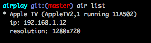
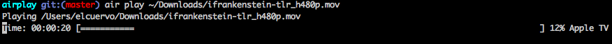
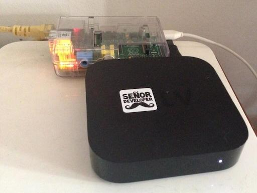

# Airplay

[](https://codeclimate.com/github/elcuervo/airplay)


Airplay attempts to be compatible with the latest AppleTV firmware but I'd like
to add compatibility to other servers.

## Contribute

You can contribute with code, bugs or feature requests.

The development of the gem takes time and there's a lot of research and hardware
tests to make all of this. If you want to contribute please consider donating as
much as you want in: [Paypal](https://www.paypal.com/cgi-bin/webscr?cmd=_s-xclick&hosted_button_id=HE867B8J6ARQ4) or [Gumroad](https://gumroad.com/l/airplay)

## Help

* irc feenode: #airplay
* twitter: http://twitter.com/airplayrb

# Table of Contents

* [Contribute](#contribute)
* [Installation](#installation)
* [Usage](#usage)
  * [CLI](#cli-1)
  * [Library](#library-1)
* [Testing](#testing)
* [Documentation](#documentation)
* [Contributors](#contributors)

## Installation

### Library

`gem install airplay`

## CLI

`gem install airplay-cli`

## Usage

### CLI

#### View devices

`air list`



```text
* Apple TV (AppleTV2,1 running 11A502)
  ip: 192.168.1.12
  resolution: 1280x720
```

#### Play a video

`air play [url to video or local file]`



```text
Playing http://movietrailers.apple.com/movies/universal/rush/rush-tlr3_480p.mov?width=848&height=352
Time: 00:00:13 [=====                                              ] 7% Apple TV
```

### Show images

`air view [url to image or image folder]`

### Library

#### Configuration

```ruby
Airplay.configure do |config|
  config.log_level      # Log4r levels (Default: Log4r::ERROR)
  config.autodiscover   # Allows to search for nodes (Default: true)
  config.host           # In which host to bind the server (Default: 0.0.0.0)
  config.port           # In which port to bind the server (Default: will find one)
  config.output         # Where to log (Default: Log4r::Outputter.stdout)
end
```

#### Devices

```ruby
require "airplay"

Airplay.devices.each do |device|
  puts device.name
end
```

#### Accessing and Grouping

```ruby
# You can access a known device easily
device = Airplay["Apple TV"]

# And add the password of the device if needed
device.password = "my super secret password"

# Or you can group known devices to have them do a given action together
Airplay.group["Backyard"] << Airplay["Apple TV"]
Airplay.group["Backyard"] << Airplay["Room TV"]

# The groups can later do some actions like:
Airplay.group["Backyard"].play("video")
```

#### Images

```ruby
require "airplay"

apple_tv = Airplay["Apple TV"]

# You can send local files
apple_tv.view("my_image.png")

# Or use remote files
apple_tv.view("https://github.com/elcuervo/airplay/raw/master/doc/img/logo.png")

# And define a transition
apple_tv.view("url_to_the_image", transition: "Dissolve")

# View all transitions
apple_tv.transitions
```

#### Video

```ruby
require "airplay"

apple_tv = Airplay["Apple TV"]
trailer = "http://movietrailers.apple.com/movies/dreamworks/needforspeed/needforspeed-tlr1xxzzs2_480p.mov"

player = apple_tv.play(trailer)
```

##### Playlist

```ruby
# You can also add videos to a playlist and let the library handle them
player.playlist << "video_url"
player.playlist << "video_path"
player.play

# Or control it yourself
player.next
player.previous

# Or if you prefer you can have several playlists
player = apple_tv.player
player.playlists["Star Wars Classic"] << "Star Wars Episode IV: A New Hope"
player.playlists["Star Wars Classic"] << "Star Wars Episode V: The Empire Strikes Back"
player.playlists["Star Wars Classic"] << "Star Wars Episode VI: Return of the Jedi"

player.playlists["Star Wars"] << "Star Wars Episode I: The Phantom Menace"
player.playlists["Star Wars"] << "Star Wars Episode II: Attack of the Clones"
player.playlists["Star Wars"] << "Star Wars Episode III: Revenge of the Sith"

player.use("Star Wars Classic")
player.play
player.wait
```

##### Player

```ruby
# Wait until the video is finished
player.wait

# Actions
player.pause
player.resume
player.stop
player.scrub
player.info
player.seek

# Access the playback time per second
player.progress -> progress {
  puts "I'm viewing #{progress.position} of #{progress.duration}"
}
```

# Testing

Now there are two types of tests: Regular unit tests and integration tests.
Thanks to the magic of the internet and a raspberry pi there are integration
tests with a real Apple TV that is currently accessible.



The Apple TV is password protected to avoid issues with the tests but is
configured in Travis CI. For that reason you won't be able to run those tests if
you don't have an Apple TV.

Run unit tests with: `rake test:unit` and integration ones with: `rake test:integration`
You can run all of them together with: `rake test:all`

## Documentation

All the documentation of the README can be found in the `doc` folder.
To generate an updated README based on the contents of `doc` please use `rake doc:generate`

## Contributors

* [sodabrew](http://github.com/sodabrew)
* [pote](http://github.com/pote)

